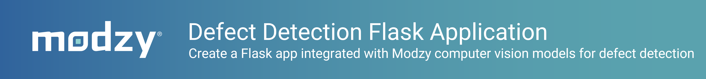

# Modzy-powered Defect Detection App



<div align="center">

<p float="center">
    
</p>

**This repository provides an example implementation of a Flask application integrated with computer vision models & Modzy edge for automated defect detection.**


<h3 align="center">
  <a href="https://docs.modzy.com/docs/edge">Modzy Edge Documentation</a>
</div>


## Overview

[Modzy edge](https://docs.modzy.com/docs/edge) provides the ability to deploy ML models to any remote device and integrate them into your custom applications. Example applications might include computer vision models running on camera devices in a manufacturing facility for worker safety, air quality models connected to sensors for air quality prediction, audio enhancement models for telecom applications, or countless other edge AI use cases. 

This repository includes an example implementation of a defect detection app that uses custom-trained YOLO models for detecting part defects on 3D-printed spur gears. Because the models are highly bespoke, the objective of this template is to simply provide a *framework* for creating custom applications using Python and Modzy edge APIs. As a result, it is expected that some of the model-specific details (e.g., model identifier, version, data source, etc.) will need to modified for your application.

*NOTE: This app was originally built to run on an NVIDIA Jetson Nano device, so some of the code may use device-specific developer packages, but this framework can be modified for other device and architecture types.*


## Getting Started

This section outlines the set of prerequisites you will need before running and interacting with the defect detection Flask app:

1. Python environment (v3.7 or greater supported) 
2. A running instance of [Modzy core](https://docs.modzy.com/docs/connect-edge-device)
3. Your model container(s) downloaded from your Modzy enterprise account

*NOTE: Modzy core will orchestrate the serving of your model(s) and expose them via Modzy's edge APIs. You may run your Flask app either on the same device or on a separate device as the device running Modzy core. The only difference in the Flask app code will be how you instantiate the Modzy edge client (via localhost if on same device or via IP address if on difference device). The following set of instructions does not distinguish between multiple device environments.*

With these prerequisites met, we can prepare our environment. First, clone this repository into your environment and navigate to the directory with the Flask app code:

```bash
git clone https://github.com/modzy/defect-detection-application.git
cd defect-detection-application/flask-app/
```

Next, create a virtual environment (virtualenv, venv, conda all work) and activate it.

```bash
python3 -m venv venv
```

_Linux or Mac OS_
```bash
source venv/bin/activate
```

_Windows_
```cmd
.\venv\Scripts\activate
```

Now, install the packages needed to run the Flask app:

```bash
pip install -r requirements.txt
```

With these Python packages installed, your environment should be set up and ready to run the Flask app. 

## Usage

### Running Modzy Core

As listed in the [Getting Started](./README.md#getting-started) section, it is expected that you have an instance of Modzy core installed on a device that will capture a video stream and feed it through your model(s) for predictions. It is also expected that the model container(s) are downloaded to your device for processing. Assuming these conditions are met, you can run Modzy core in server mode:

```bash
./modzy-core server --resume
```

For more detailed instructions, please visit the Modzy Core CLI [documentation](https://docs.modzy.com/docs/modzy-core-cli).
 
### Running Flask App

Before running the application, there are a few changes you will need to make in the code itself.

First, navigate to [configuration section](./flask-app/app.py#L16-#L28) of the Flask app code and make any changes specific to your model and/or application. At a minimum, you will need to edit the `MODEL_ID`, `MODEL_VERSION`, and `NAMES` variables to represent your model's specific config and class labels.  

Next, edit the [edge client instantiation](./flask-app/app.py#L117) based on the location your Flask app is running relative to the device running Modzy core. If you are running this app on the same device, you will keep the host as "localhost". Otherwise, insert the IP address of your device running Modzy core.

Finally, you can run the Flask app code:

```bash
python3 app.py
```

If successful, you should see the following log lines in your terminal:

```
 * Serving Flask app 'stream_flask_new' (lazy loading)
 * Environment: production
   WARNING: This is a development server. Do not use it in a production deployment.
   Use a production WSGI server instead.
 * Debug mode: off
 * Running on all addresses.
   WARNING: This is a development server. Do not use it in a production deployment.
 * Running on http://<device-IP-address>:8000/ (Press CTRL+C to quit)
```
